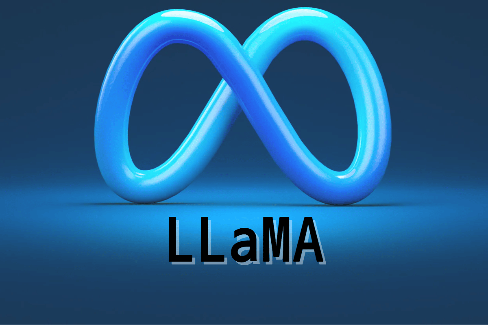
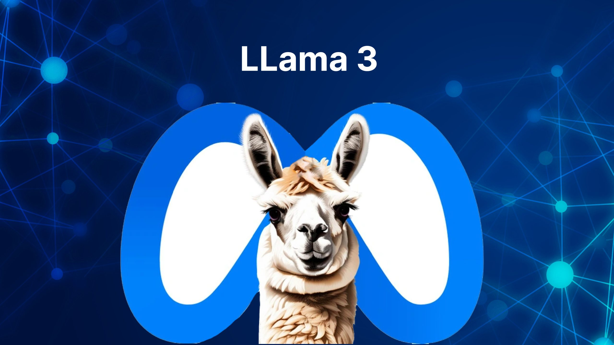

# GenAI-LLM-Meta-Llama3

# Table of Contents

- [Overview](#overview)
- [Requirements](#requirements)
- [Installation](#Installation)
- [Contribution](#contribution)
- [License](#license)
- [Contact](#contact)

## Overview
Llama 3 is Meta/Facebook LLM Model





### LLAMA Models:
https://llama.meta.com/


## Requirements

### Hugging Face
https://huggingface.co/
https://huggingface.co/meta-llama/Meta-Llama-3-8B

model="meta-llama/Meta-Llama-3-8B"

HF_TOKEN_KEY=""


### Open Google Colab

1. Change runtime type
2. Select :  T4 GPU 


## Installation
   
1. Clone this repository to your local machine using:

```bash
  git clone https://github.com/alexvatti/GenAI-LLM-Meta-Llama3.git
```

## Contribution

Feel free to contribute and enhance the project!

## License
This project is licensed under the [MIT License](LICENSE).

## Contact
For any inquiries or issues, please contact Alex at alexvatti@gmail.com
